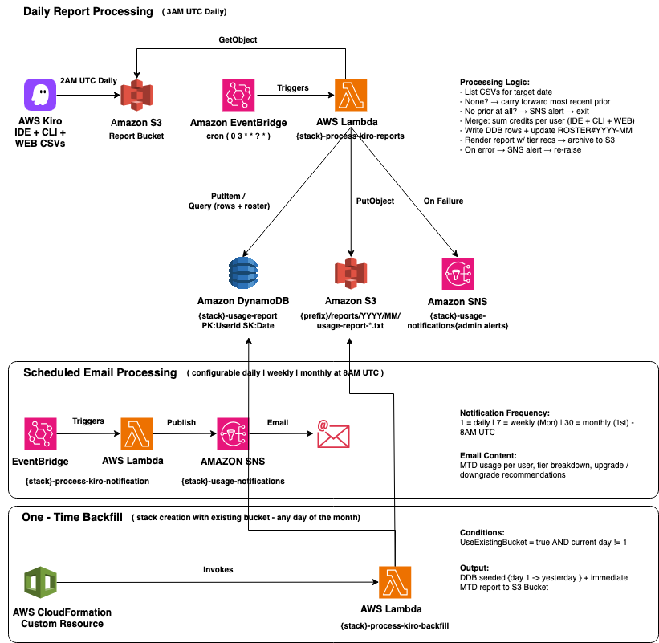

# Publish Date 
August 05, 2026

# Kiro Cost Optimizer

Automated cost optimization for **Kiro Enterprise**. Ingests daily per-user activity reports (IDE + CLI + WEB), accumulates month-to-date credit usage per user, and emails tier upgrade/downgrade recommendations on a configurable daily, weekly, or monthly schedule.

# Authors
- Nikhil Arora
- Rob Yang

## Quick Start

### Prerequisites

- AWS CLI configured with appropriate credentials
- Kiro Enterprise account with user activity reports enabled
- Valid email address for notifications

### Deploy

```bash
aws cloudformation deploy \
  --template-file cfn/kiro-cost-optimizer.yaml \
  --stack-name kiro-cost-optimizer \
  --parameter-overrides \
      UseExistingBucket=false \
      ReportPrefix=kiro-user-activity \
      KiroProfileRegion=us-east-1 \
      NotificationEmail=your-email@example.com \
      NotificationFrequency=7 \
  --capabilities CAPABILITY_IAM
```

`NotificationFrequency`: `1` = daily, `7` = weekly (Mondays), `30` = monthly (1st).

### Enable Reports in Kiro Console

1. Get the S3 URI from stack outputs:
   ```bash
   aws cloudformation describe-stacks \
     --stack-name kiro-cost-optimizer \
     --query 'Stacks[0].Outputs[?OutputKey==`ReportS3Uri`].OutputValue' \
     --output text
   ```
2. Go to **[Kiro Console → Settings](https://us-east-1.console.aws.amazon.com/amazonq/developer/home?region=us-east-1#/settings)**.
3. Under **Kiro user activity reports**, click **Edit**, toggle **Collect granular metrics per user** ON, paste the S3 URI, and **Save**.

### Confirm Email Subscription

Click the SNS subscription confirmation link sent to your inbox. Reports begin arriving the next day at 2:00 AM UTC; the first optimization email follows on your chosen schedule.

## Overview

Kiro Enterprise delivers daily usage reports to S3 at 2:00 AM UTC, split by client type (`KIRO_IDE_*.csv`,`KIRO_WEB_*.csv`, `KIRO_CLI_*.csv`). At 3:00 AM UTC the `process-kiro-reports` Lambda:

- **Merges** all CSVs for the target date, summing `Credits_Used` and `Overage_Credits_Used` per user across client types. If no report exists for the date, the most recent prior report is carried forward (labelled accordingly).
- **Persists** one consolidated row per user per day to DynamoDB (idempotent) and **accumulates** per-user month-to-date totals across a per-month user roster, so users active earlier in the month still appear on days they had no usage. The roster resets on the 1st.
- **Archives** the rendered report to S3 (`<ReportPrefix>/reports/YYYY/MM/`) and **alerts** the admin via SNS if no report exists on or before the target date, or if processing fails.

A separate, independently scheduled `process-kiro-notification` Lambda reads the latest archived report from S3 and emails it on the `NotificationFrequency` schedule. A one-time `process-kiro-backfill` Lambda seeds the current month's prior days when installing against an existing bucket mid-month (see [Mid-month installs](#mid-month-installs-backfill)).

## Architecture



## Report File Naming Convention

Kiro delivers reports with separate CSVs per client type:

```
{ReportPrefix}/AWSLogs/{AccountId}/KiroLogs/user_report/{Region}/YYYY/MM/DD/HH/KIRO_{ClientType}_{AccountId}_user_report_YYYYMMDDHHNN.csv
```

The Lambda collects **all** `.csv` files for a date and sums credits per user across client types before writing a single consolidated row to DynamoDB. Processed reports are archived under `{ReportPrefix}/reports/YYYY/MM/usage-report-YYYY-MM-DD-HHMMSS.txt`.

## Tier Limits & Pricing Logic

| Tier | Monthly Credits | Base Price | Overage Rate |
|------|----------------|------------|--------------|
| Pro | 1,000 | $20/mo | $0.04/credit |
| Pro+ | 2,000 | $40/mo | $0.04/credit |
| Pro Max | 5,000 | $100/mo | $0.04/credit |
| Power | 10,000 | $200/mo | $0.04/credit |

Reference: [Kiro Enterprise Billing](https://kiro.dev/docs/cli/enterprise/billing/)

The report produces a unified **"Cost Optimization Recommendations"** section with both upgrade and downgrade suggestions.

- **Upgrades (always active):** the Lambda computes each user's total monthly cost on their current tier (`base + overage × $0.04`) from MTD usage and recommends the cheapest higher tier whose total cost is at or below what they already pay. The recommendation either saves money or, at break-even, costs the same while granting more credits. It can skip tiers (e.g. a heavy Pro user straight to Pro Max).

- **Downgrades (last 5 days of the month only):** during the end-of-month window, the Lambda checks whether a user would be cheaper on a lower tier (accounting for overage there) and recommends the cheapest one. Downgrades say **"next month"** because, per [billing rules](https://kiro.dev/docs/cli/enterprise/billing/), they take effect the following month. The window is limited to the last 5 days because earlier in the month low usage is misleading.

## Deployment Options

### Using an existing bucket

Use the same [Deploy](#deploy) command, overriding these two parameters:

```bash
      UseExistingBucket=true \
      BucketName=my-existing-kiro-reports-bucket \
```

After deployment, check the `RequiredBucketPolicyStatement` stack output for the policy statement to add to your bucket manually.

### Mid-month installs (backfill)

When installing against an existing bucket that already has reports and it's not the 1st, the `process-kiro-backfill` Lambda runs once during stack creation and seeds DynamoDB with every report from the 1st of the current month up to yesterday, so MTD totals are correct on the next 3:00 AM run.

- Runs **once** per stack create; idempotent `put_item`s.
- **Skips** when `UseExistingBucket=false` or when run on the 1st.
- **Best-effort:** errors are logged but never block or roll back the stack.

To (re)seed specific days manually, invoke the processing Lambda per date with `{"date": "YYYY-MM-DD"}` (see [Manual Lambda Invocation](#manual-lambda-invocation)).

## Customization

All Lambda source code is embedded inline in `cfn/kiro-cost-optimizer.yaml` (under each function's `Code` → `ZipFile`). Edit the inline code and redeploy to change behavior.

**Tier limits** — edit the `TIER_LIMITS` dictionary in the inline Lambda code:

```python
TIER_LIMITS = {'Pro': 1000, 'Pro+': 2000, 'Pro Max': 5000, 'Power': 10000}
```

**Processing schedule** — hardcoded to 3:00 AM UTC (`cron(0 3 * * ? *)`) in the `DailyProcessingRule` EventBridge rule, since Kiro delivers at a fixed 2:00 AM UTC. Edit its `ScheduleExpression` to change. The **notification** schedule is configurable at deploy time via `NotificationFrequency`.

## Testing

```bash
# Manual invocation
aws lambda invoke \
  --function-name kiro-cost-optimizer-process-kiro-reports \
  --payload '{}' response.json && cat response.json

# Logs
aws logs tail /aws/lambda/kiro-cost-optimizer-process-kiro-reports --follow
```

## Sample Output

The email is split into two sections: users with a recommendation first, then everyone else. Within each, users are grouped by tier (Power → Pro+ → Pro) and sorted by MTD credits descending.

```
Subject: Kiro Usage Report (2026-06-05) - 4 user(s)

Kiro Usage Report - 2026-06-05
Month-to-date accumulation (2026-06)
Data as of: 2026-06-05 (UTC)
Total users: 4
Total estimated savings: $64.00/mo

=== Cost Optimization Recommendations (2 user(s)) ===
User                | Tier | MTD Credits | MTD Overage | Recommendation
--------------------+------+-------------+-------------+-----------------------------------
bob@example.com     | PRO+ |     7000.00 |     5000.00 | Upgrade to Power (saves $40.00/mo)
alice@example.com   | PRO  |     2100.00 |     1100.00 | Upgrade to Pro+ (saves $24.00/mo)

=== All Other Users (2 user(s)) ===
carol@example.com   | POWER |     8200.00 |        0.00 | -
dave@example.com    | PRO   |      450.00 |        0.00 | -
```

Variants:
- **End-of-month (last 5 days):** downgrade recommendations also appear, e.g. `Downgrade to Pro next month (saves $148.00/mo)`.
- **Carried-forward (no report for the date):** the subject and header note the source date, e.g. `Data as of: 2026-06-05 (UTC) (carried forward - no new report for 2026-06-07)`.

> SNS email is plain text, so tables use fixed-width columns (best in a monospace font). The full report is also archived to S3. A 500-user report is ~50 KB, well within the SNS 256 KB limit.

## Cost Estimation

| Service | Monthly Cost |
|---------|-------------|
| S3 | ~$0.03 |
| Lambda | ~$0.01 |
| DynamoDB | ~$0.00 (on-demand) |
| SNS | ~$0.00 |
| EventBridge | Free |
| **Total** | **~$0.04** |

*Estimated based on US East (N. Virginia) pricing with daily report and no free tier.*

## Troubleshooting

**No reports found** — the Lambda carries forward the most recent prior report; it only alerts when no report exists on or before the target date. Common causes: feature not enabled, S3 bucket policy doesn't allow `q.amazonaws.com` to write, incorrect `ReportPrefix`, or first day after enabling (wait 24h).

**Lambda execution errors** — check CloudWatch Logs; verify S3 read permissions and that bucket name/prefix match parameters.

**Email not received** — Confirm the SNS subscription, check spam, review CloudWatch Logs for publish errors.

## Cleaning Up

```bash
aws cloudformation delete-stack --stack-name kiro-cost-optimizer
```

Removes the Lambdas, EventBridge rules, SNS topic, DynamoDB table, and (if the stack created it) the S3 bucket. An existing bucket (`UseExistingBucket=true`) and its contents are retained.

## Security

- S3 encryption (AES256), public access blocked, versioning enabled for audit trail
- Lambda follows least-privilege IAM

See [CONTRIBUTING](CONTRIBUTING.md#security-issue-notifications) for reporting security issues.

## Project Structure

```
.
├── README.md
└── cfn/
    └── kiro-cost-optimizer.yaml  # Complete stack; all Lambda code embedded inline
```


## References

- [User Activity Reports](https://kiro.dev/docs/cli/enterprise/monitor-and-track/user-activity/)
- [Enterprise Settings](https://kiro.dev/docs/enterprise/settings/)
- [Pricing](https://kiro.dev/pricing/)

## Contributing & License

See [CONTRIBUTING](CONTRIBUTING.md). Licensed under MIT-0 — see [LICENSE](LICENSE.txt).
